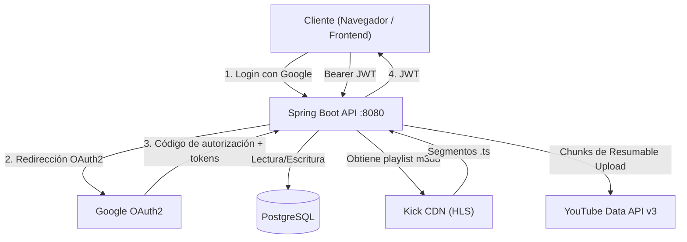
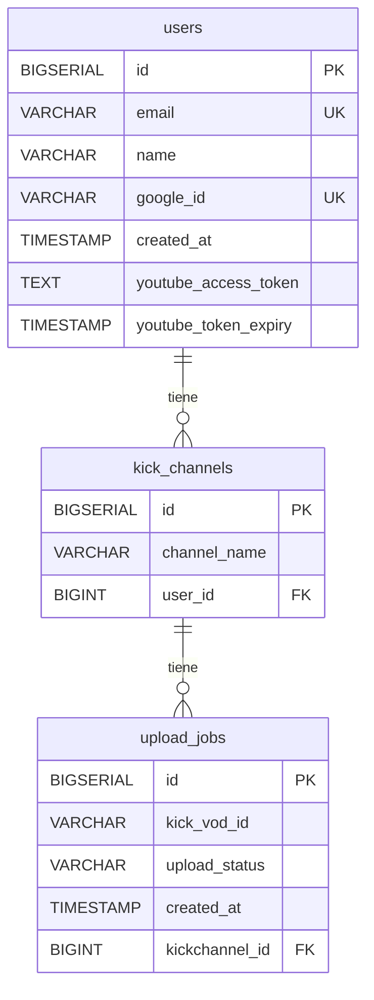
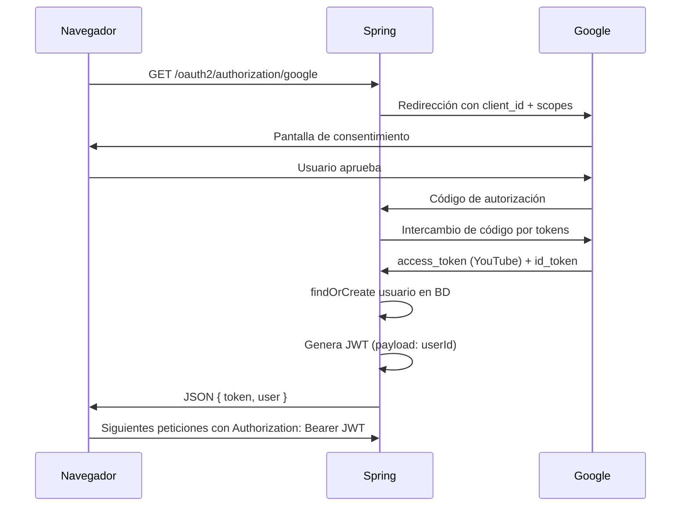
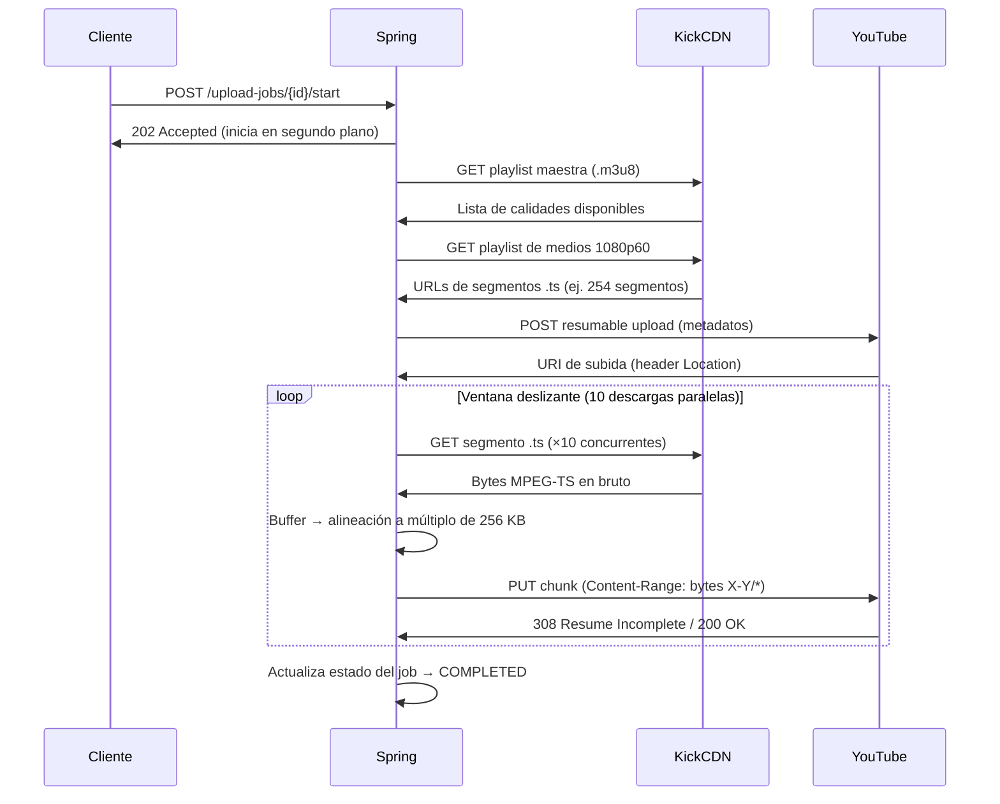

# Kick AutoUploader


### Proyecto desarrollado por [DMRstudio.dev](https://dmrstudio.dev/)

Backend desarrollado con Spring Boot que autentica usuarios mediante Google OAuth2, registra su canal de Kick y sube automáticamente los VODs a YouTube usando la API de Resumable Upload.
Diseñado para funcionar con múltiples usuarios en paralelo.


> **Nota:** Si la variable `FRONTEND_URL` no está configurada en el entorno, el flujo de autenticación con Google no realizará ninguna redirección. En su lugar, devolverá directamente un JSON con el Access Token listo para usar en la API:
> ```json
> { "token": "eyJ...", "user": { "id": 1, "email": "...", "name": "..." } }
> ```
> Esto es útil para probar el backend con Postman u otros clientes sin necesidad de tener el frontend en marcha.

## ¿Buscas un Frontend para este Backend?
Estará disponible pronto

---

## Índice

- [Arquitectura](#arquitectura)
- [Stack tecnológico](#stack-tecnológico)
- [Esquema de base de datos](#esquema-de-base-de-datos)
- [Referencia de la API](#referencia-de-la-api)
- [Flujo de autenticación](#flujo-de-autenticación)
- [Flujo de subida](#flujo-de-subida)
- [Puesta en marcha](#puesta-en-marcha)
- [Variables de entorno](#variables-de-entorno)
- [Docker](#docker)
- [Contribuir](#contribuir)

---

## Arquitectura



---

## Stack tecnológico

| Capa | Tecnología |
|---|---|
| Lenguaje | Java 21 |
| Framework | Spring Boot 3.5 |
| Seguridad | Spring Security + OAuth2 Client |
| Tokens de auth | JWT (jjwt 0.12.6) |
| Persistencia | Spring Data JPA / Hibernate |
| Base de datos | PostgreSQL 16 |
| Cliente HTTP | Spring RestClient |
| Asincronía | Spring `@Async` + `ThreadPoolTaskExecutor` |
| Build | Maven |
| Runtime | Docker / eclipse-temurin:21-jre-alpine |

---

## Esquema de base de datos



### Descripción de tablas

**users**

| Columna | Tipo | Notas |
|---|---|---|
| id | BIGSERIAL | Clave primaria |
| email | VARCHAR(255) | Único, obtenido del perfil de Google |
| name | VARCHAR(255) | Nombre de visualización de Google |
| google_id | VARCHAR(255) | Subject ID único de Google |
| created_at | TIMESTAMP | Se asigna en la inserción |
| youtube_access_token | TEXT | Token OAuth2 para subidas a YouTube |
| youtube_token_expiry | TIMESTAMP | Fecha de expiración del token de YouTube |

**kick_channels**

| Columna | Tipo | Notas |
|---|---|---|
| id | BIGSERIAL | Clave primaria |
| channel_name | VARCHAR(255) | Slug del canal de Kick (ej. `johndoe`) |
| user_id | BIGINT | FK → users.id |

**upload_jobs**

| Columna | Tipo | Notas |
|---|---|---|
| id | BIGSERIAL | Clave primaria |
| kick_vod_id | VARCHAR(255) | UUID del VOD en Kick |
| upload_status | VARCHAR(255) | Enum: ver valores abajo |
| created_at | TIMESTAMP | Se asigna en la inserción |
| kickchannel_id | BIGINT | FK → kick_channels.id |

**Valores del enum UploadStatus**

| Valor | Significado |
|---|---|
| `PENDING` | Job creado, sin iniciar |
| `DOWNLOADING` | Obteniendo la playlist m3u8 y resolviendo segmentos |
| `UPLOADING` | Enviando chunks a YouTube |
| `COMPLETED` | Subida completada con éxito |
| `FAILED` | Se produjo un error irrecuperable |

---

## Referencia de la API

Todos los endpoints requieren `Authorization: Bearer <JWT>` excepto la redirección de login OAuth2.

### Usuarios

| Método | Ruta | Descripción |
|---|---|---|
| GET | `/users/{id}` | Obtener usuario por ID |
| GET | `/users/email/{email}` | Obtener usuario por email |

### Canales de Kick

| Método | Ruta | Body | Descripción |
|---|---|---|---|
| GET | `/kickchannels/{id}` | — | Obtener canal por ID |
| POST | `/kickchannels` | `{ channelName, userId }` | Registrar un canal de Kick |

### Jobs de subida

| Método | Ruta | Body | Descripción |
|---|---|---|---|
| GET | `/upload-jobs/{id}` | — | Obtener job con progreso en tiempo real (0–100) |
| GET | `/upload-jobs/channel/{channelId}` | — | Listar todos los jobs de un canal |
| POST | `/upload-jobs` | `{ kickVodId, kickChannelId }` | Crear un job |
| POST | `/upload-jobs/{id}/start` | Ver abajo | Iniciar la subida de forma asíncrona |

**Body de `POST /upload-jobs/{id}/start`**

```json
{
  "m3u8Url":      "https://stream.kick.com/.../playlist.m3u8",
  "title":        "Título del VOD",
  "description":  "Stream del 8 de junio",
  "tags":         ["gaming", "kick"],
  "privacyStatus": "private"
}
```

`m3u8Url` es obligatorio. El resto de campos son opcionales. `privacyStatus` acepta `public`, `private` o `unlisted` (por defecto: `private`).

Devuelve `202 Accepted` inmediatamente. Haz polling a `GET /upload-jobs/{id}` para seguir el progreso.

---

## Flujo de autenticación



El scope de Google OAuth2 incluye `https://www.googleapis.com/auth/youtube.upload`, por lo que el access token obtenido se usa directamente para las subidas a YouTube sin un paso de autenticación adicional.

---

## Flujo de subida



### Alineación de chunks

La API de Resumable Upload de YouTube exige que todos los chunks excepto el último sean múltiplos exactos de 256 KB (262.144 bytes). El servicio acumula segmentos `.ts` en un buffer y solo envía fragmentos alineados, guardando el resto para el siguiente chunk.

### Concurrencia

| Capa | Configuración | Valor por defecto |
|---|---|---|
| Jobs de subida simultáneos | `maxPoolSize` en `AsyncConfig` | 4 |
| Descargas `.ts` paralelas por job | `DOWNLOAD_WINDOW` en `YoutubeService` | 10 |
| Capacidad de cola (jobs en espera) | `queueCapacity` en `AsyncConfig` | 20 |

Cuando la cola está llena, `POST /upload-jobs/{id}/start` devuelve `503 Service Unavailable`.

---

## Puesta en marcha

### Requisitos previos

- Java 21
- Docker y Docker Compose
- Un proyecto en Google Cloud con credenciales OAuth2 y la YouTube Data API v3 habilitada

### 1. Clonar el repositorio

```bash
git clone https://github.com/tu-usuario/vod-autouploader.git
cd vod-autouploader
```

### 2. Configurar las variables de entorno

```bash
cp .env.example .env
```

Edita `.env` con tus valores. Consulta la sección [Variables de entorno](#variables-de-entorno).

### 3. Iniciar PostgreSQL

```bash
docker compose up -d postgres
```

### 4. Ejecutar la aplicación

```bash
./mvnw spring-boot:run
```

La API estará disponible en `http://localhost:8080`.

### Configuración de Google OAuth2

1. Ve a [Google Cloud Console](https://console.cloud.google.com) → APIs y servicios → Credenciales
2. Crea un ID de cliente OAuth 2.0 (Aplicación web)
3. Añade `http://localhost:8080/login/oauth2/code/google` a las URIs de redirección autorizadas
4. Habilita la **YouTube Data API v3** en APIs y servicios → Biblioteca
5. Copia el client ID y el secret en tu `.env`

---

## Variables de entorno

| Variable | Requerida | Descripción |
|---|---|---|
| `GOOGLE_CLIENT_ID` | Sí | Client ID de Google OAuth2 |
| `GOOGLE_CLIENT_SECRET` | Sí | Client secret de Google OAuth2 |
| `DB_URL` | Sí | URL JDBC (ej. `jdbc:postgresql://localhost:5432/kickdb`) |
| `DB_USER` | Sí | Usuario de la base de datos |
| `DB_PASSWORD` | Sí | Contraseña de la base de datos |
| `JWT_SECRET` | Sí | Secret en Base64 (mínimo 256 bits). Genera uno con: `openssl rand -base64 64` |
| `FRONTEND_URL` | Sí | Origen permitido por CORS (ej. `http://localhost:5173`) |
| `APP_BASE_URL` | Sí | URL pública del backend, sin barra final (ej. `https://api.tudominio.com`) |

---

## Docker

Se incluye un Dockerfile multistage. La primera etapa compila el JAR con Maven; la segunda lo ejecuta sobre una imagen mínima de JRE.

```bash
docker build -t vod-autouploader .
docker run -p 8080:8080 --env-file .env vod-autouploader
```

Para levantar el stack completo (aplicación + base de datos):

```bash
docker compose up
```

---

## Estructura del proyecto

```
src/main/java/dev/dmrstudio/vod_autouploader/
├── config/
│   ├── AsyncConfig.java             # ThreadPoolTaskExecutor para jobs de subida
│   ├── JwtAuthFilter.java           # OncePerRequestFilter — valida el Bearer token
│   ├── OAuth2SuccessHandler.java    # Post-login: persiste el usuario y emite el JWT
│   └── SecurityConfig.java          # CSRF deshabilitado, login OAuth2, cadena de filtros
├── controller/
│   ├── KickChannelController.java
│   ├── UploadJobController.java
│   └── UserController.java
├── dto/
│   ├── kick/
│   │   ├── KickVideoDetail.java
│   │   └── KickVideoEntry.java
│   ├── CreateKickChannelRequest.java
│   ├── CreateUploadJobRequest.java
│   ├── CreateUserRequest.java
│   └── StartUploadJobRequest.java
├── model/
│   ├── KickChannel.java
│   ├── UploadJob.java
│   ├── UploadStatus.java
│   └── User.java
├── repository/
│   ├── KickChannelRepository.java
│   ├── UploadJobRepository.java
│   └── UserRepository.java
└── service/
    ├── JwtService.java              # Generación y validación de tokens
    ├── KickChannelService.java
    ├── KickService.java             # Obtiene la playlist m3u8 y resuelve segmentos
    ├── ProgressService.java         # Mapa de progreso en memoria (ConcurrentHashMap)
    ├── UploadJobService.java
    ├── UserService.java
    └── YoutubeService.java          # Orquestación del Resumable Upload
```

---

## Limitaciones conocidas

- **API de Kick y Cloudflare**: El endpoint `kick.com/api/v2` está protegido por el bot management de Cloudflare. La URL m3u8 debe proporcionarse manualmente en `POST /upload-jobs/{id}/start`, ya que el backend no puede resolverla automáticamente a partir del ID del VOD. Se planea integrar Playwright para automatizar este paso.
- **Renovación del token de YouTube**: Los access tokens expiran tras 1 hora. El usuario debe volver a autenticarse con Google para obtener uno nuevo. La renovación automática mediante refresh token no está implementada aún.
- **Persistencia del progreso**: El progreso de la subida (0–100) se guarda únicamente en memoria y se pierde al reiniciar el servidor.

---

## Contribuir

1. Haz un fork del repositorio
2. Crea una rama: `git checkout -b feature/mi-mejora`
3. Haz commit de tus cambios
4. Abre un pull request

No subas archivos `.env` ni ningún tipo de credencial al repositorio.

---

## Autor

Desarrollado por **System32** — [dmrstudio.dev](https://dmrstudio.dev/contacto/)

GitHub: [github.com/System32-0101](https://github.com/System32-0101)

---
# Licencia

Este proyecto está licenciado bajo la **GNU Affero General Public License v3.0 (AGPL-3.0)**.

La licencia completa puede consultarse en el archivo [LICENSE](LICENSE) o en la web oficial de GNU:
https://www.gnu.org/licenses/agpl-3.0.html

## Qué puedes hacer

✔️ Utilizar el software para cualquier propósito.

✔️ Ejecutarlo en entornos privados o públicos.

✔️ Estudiar cómo funciona y modificar el código fuente.

✔️ Redistribuir copias del proyecto original.

✔️ Distribuir versiones modificadas.

✔️ Ofrecer el software como servicio (SaaS).

## Condiciones

⚠️ Debes mantener los avisos de copyright y licencia originales.

⚠️ Si distribuyes una versión modificada, debes hacerlo bajo la misma licencia AGPL-3.0.

⚠️ Si los usuarios interactúan con una versión modificada a través de una red (por ejemplo, una aplicación web o API pública), debes poner a su disposición el código fuente correspondiente.

⚠️ Debes indicar claramente qué cambios has realizado respecto al proyecto original.

## Limitaciones

❌ No puedes convertir modificaciones de este proyecto en software propietario o de código cerrado.

❌ No puedes eliminar los avisos de copyright ni la licencia original.

## Código fuente

Si utilizas una instancia pública de este software, el código fuente correspondiente debe estar disponible para sus usuarios conforme a los términos de la AGPL-3.0.

Copyright (C) 2026 DMRstudio - Systemm32
